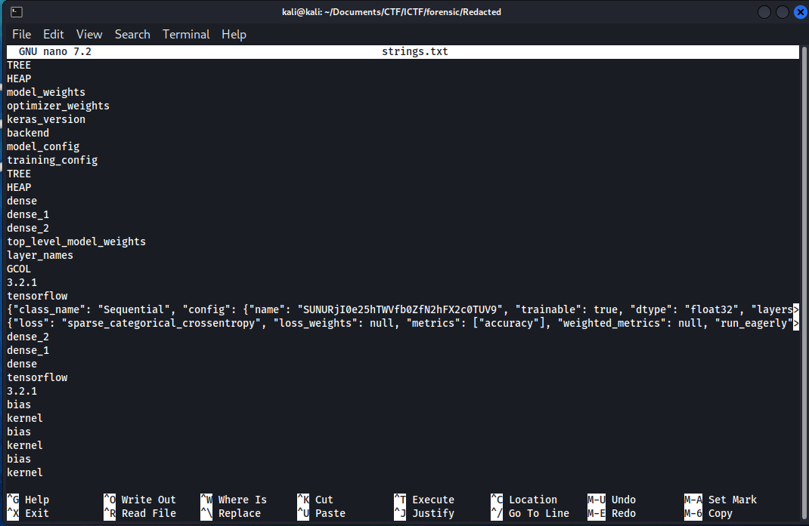
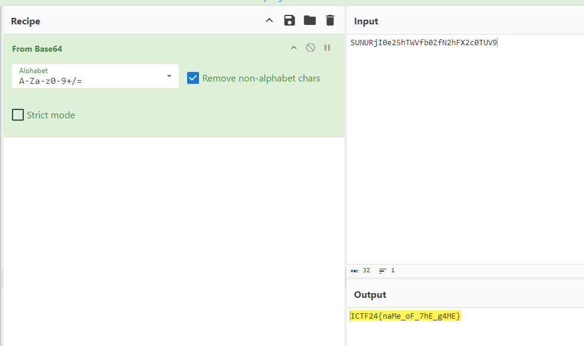

# Solution for challenge REDACTED

Description :
- Category : Forensic
- Points : 100

A file name called ``REDACTED.h5`` came along with the challenge. This is my first time encounter a .h5 file, so my first reaction is to ``strings`` the file which shows a lot of random strings but in order to read all the strings, I append all the strings into a text file. This can be done using ``strings REDACTED.h5 > strings.txt``

If we ``nano`` the file, we are able to read everything that is appended into the strings text file just now. We know that the challenge wants us to identify the AI's name so we can see in the config session there is a name with a random string ``SUNURjI0e25hTWVfb0ZfN2hFX2c0TUV9``.

Decrypting the string will give us the flag ``ICTF24{naMe_oF_7hE_g4ME}``

