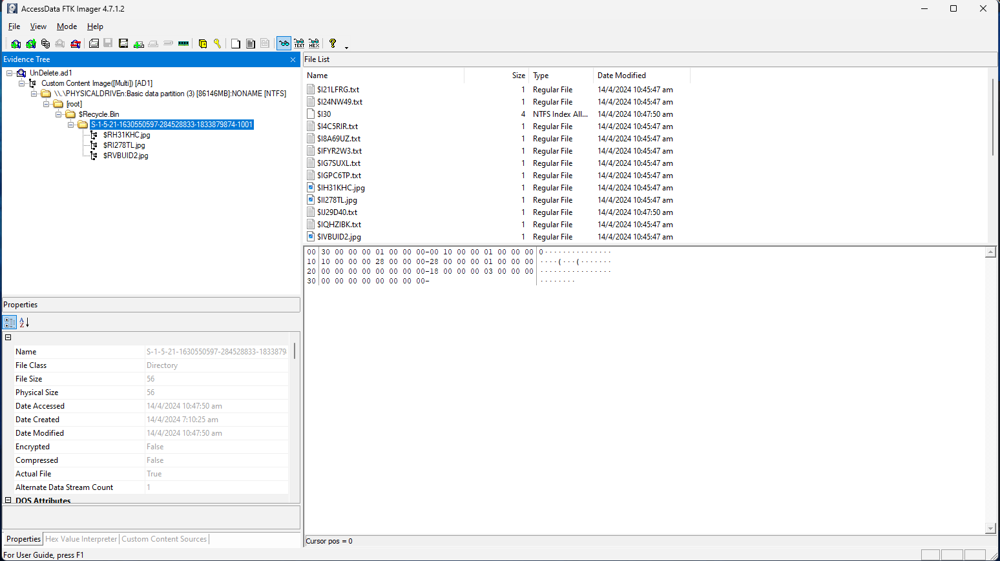
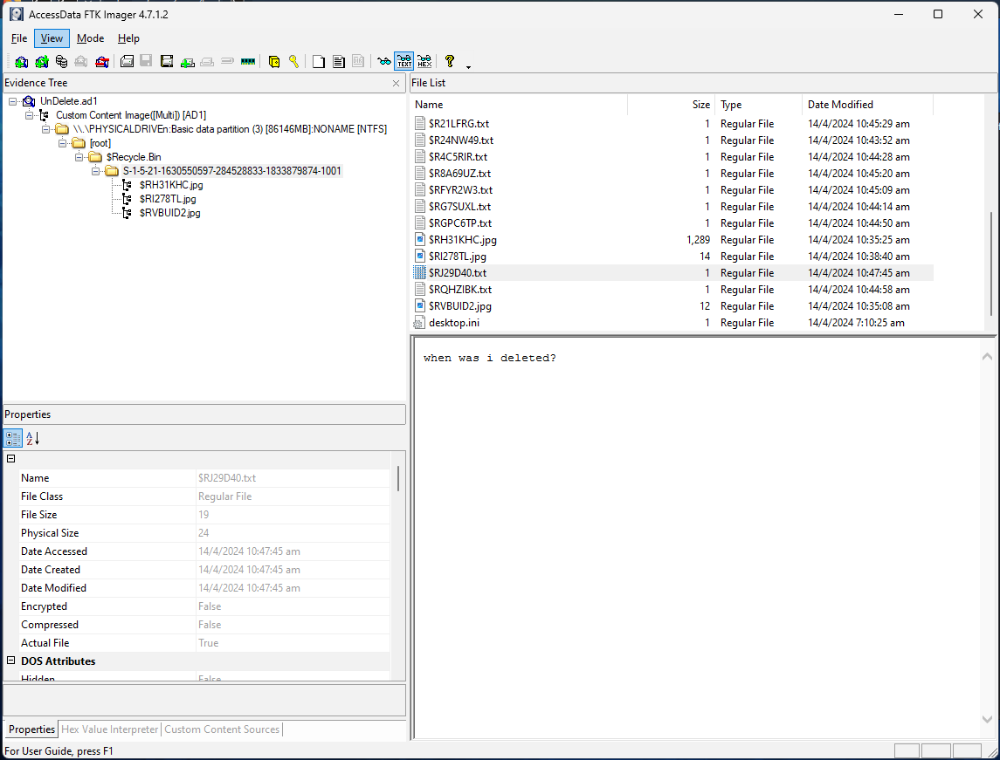
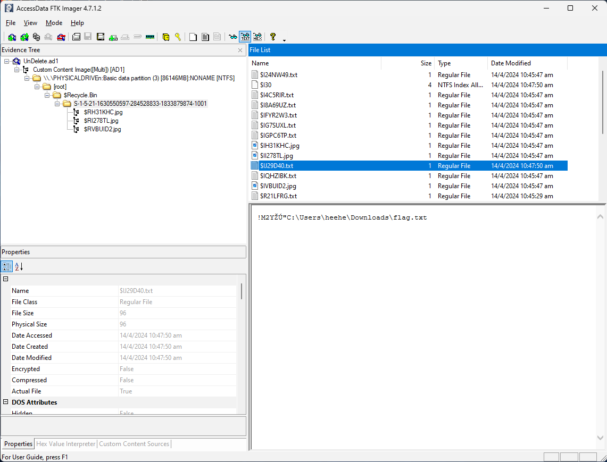

# Solution for challenge UnDelete

Description : 
- Category : Forensic
- Points : 200
- Flag format : ``ICTF24{DD/MM/YY HH:MM:SS AM}``

The file attached is a ``.ad1`` file which can be open using FTK Imager. 

After opening the ``.ad1`` file in FTK imager, expand the directory until the end.

After browsing through all the files and data. 2 files caught my attention. 

The first one was this :

It says in the file ``when was i deleted?``. So I tried to input the date and time into the answer box but turn out to be wrong. 

Let's proceed with the another suspicious file : 

It seems like it is a ``flag.txt`` file and as a CTF player the keyword ``flag.txt`` or ``flag`` is always a sensitive word to us so I tried with the date and time of this file and it is the correct flag. ``ICTF24{14/04/2024 10:47:50 AM}``