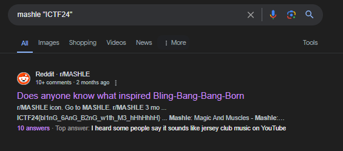

# Solution for challenge Bling-Bang-Bang-Born


Description : 

- Category    - OSINT
- Points      - 100 points


Based on question, 2 key terms can be obtained : 
- bling bang bang born
- Mashle

After google searching both key terms, we know that the bling bang bang born is a song and Mashle is an anime series.


Nothing much special about both information.

We know that the flag format is "ICTF24{}" so we can include it when searching.

We get the following search : 



And here is the flag :


```ICTF24{bl1nG_6AnG_B2nG_w1th_M3_hHhHhhH}```