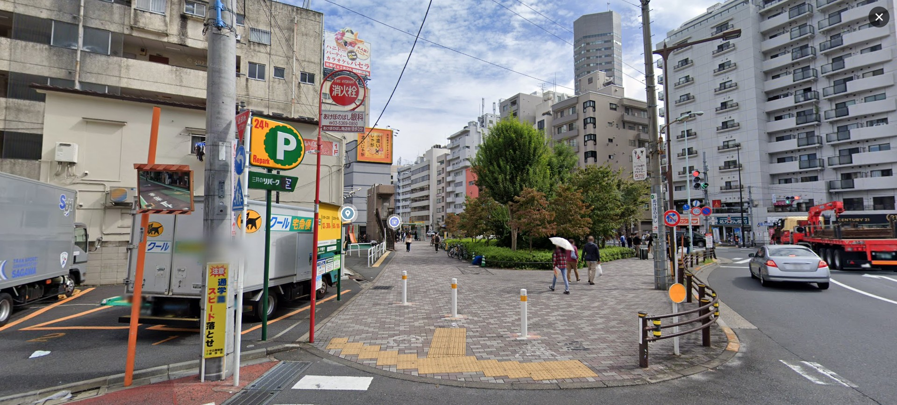

# Solution for challenge Language Barrier


Description : 
- Category : OSINT
- Points : 200


A image is attached along with the challenge question :



By throwing the image into google image, we can find [this](https://apartment-japan.tokyo/sale/apartment/6114/) site which show where the building is located.

After knowing where the approximate location of the image, we can continue analyze the image to get more info. 

We can see that there is a car park and 2 dots in the middle of the image which one of the icon is an atm machine icon. Gathering all the information, we can know where the location of the image is and using the latitute and longitute, we can get the flag.


From the [link](https://www.google.com/maps/@35.6927101,139.7212742,3a,75y,124.89h,100.88t/data=!3m7!1e1!3m5!1sR3YU7phzifm5p6Ydm0CVfQ!2e0!6shttps:%2F%2Fstreetviewpixels-pa.googleapis.com%2Fv1%2Fthumbnail%3Fpanoid%3DR3YU7phzifm5p6Ydm0CVfQ%26cb_client%3Dmaps_sv.tactile.gps%26w%3D203%26h%3D100%26yaw%3D314.2835%26pitch%3D0%26thumbfov%3D100!7i16384!8i8192?entry=ttu) of the google image, we can get the coords of the image and also the flag

``` ICTF24{35.6927101_139.7212742} ```
