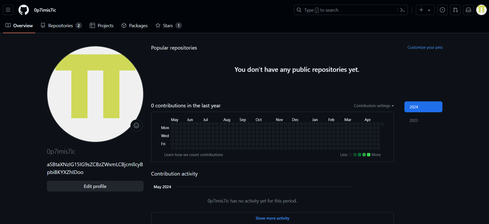
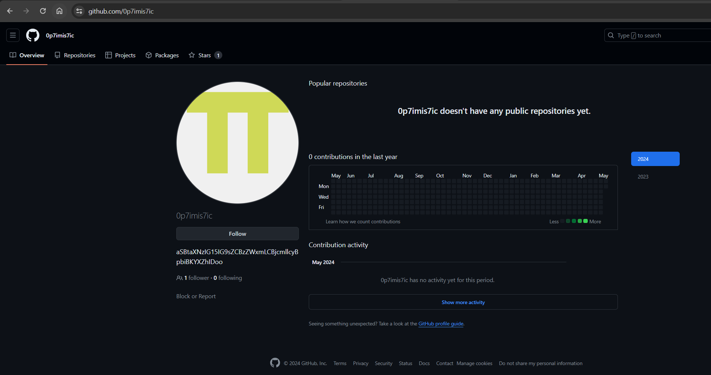
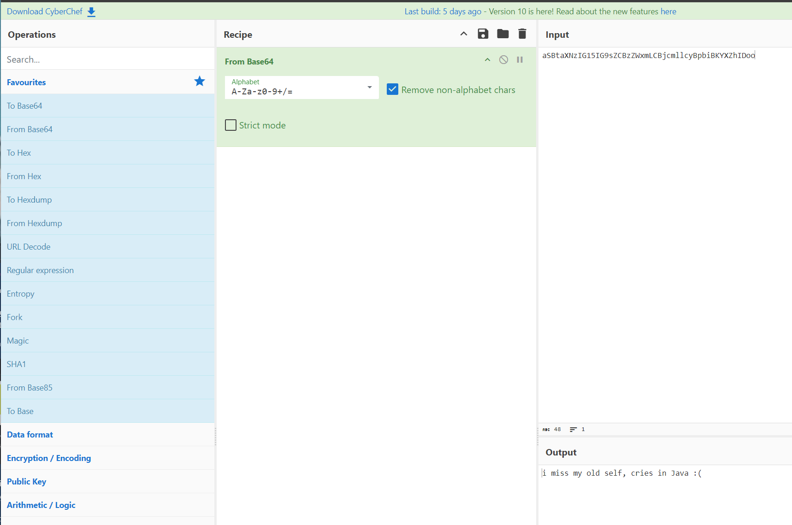
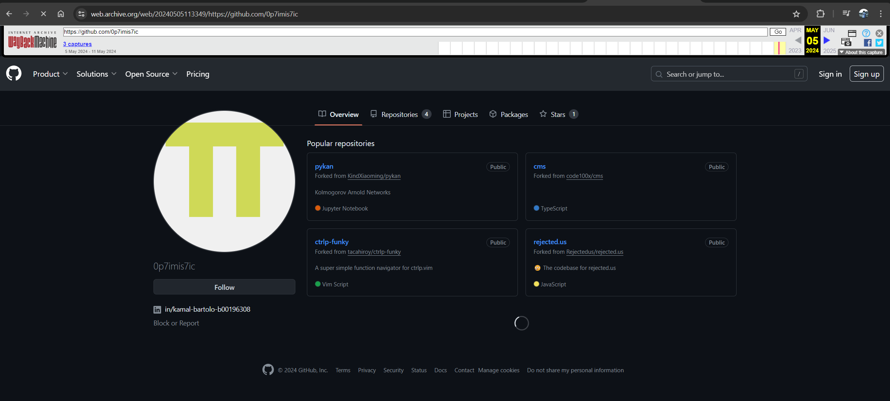
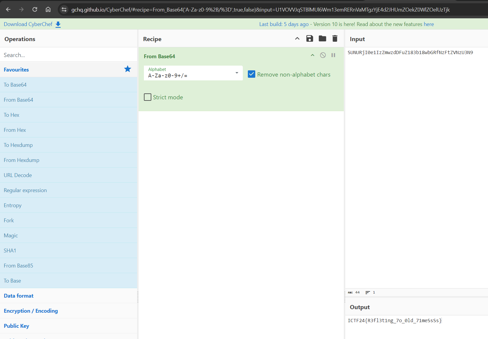

# Solution for challenge Thinking about the past


Description : 
- Category : OSINT
- Points : 200

The challenge included a image of a github profile.



From the given username ```0p7imis7ic``` we can go search for the user in github.

This is the profile that we search for : 

but we can see that there is not repository available or anything but there is a suspicious string ```aSBtaXNzIG15IG9sZCBzZWxmLCBjcmllcyBpbiBKYXZhIDoo``` there. By throwing it into cyberchef, we get this ```i miss my old self, cries in Java :(```



If you compare the latest version of the profile with the image in the challenge, we can realise that in the image of challenge there are 2 repo available in the repository tab. By using a wayback machine, we can find the [old version](https://web.archive.org/web/20240505113349/https://github.com/0p7imis7ic) of profile.



We can see that there is a [linkedin](https://www.linkedin.com/in/kamal-bartolo-b00196308/) account. After browsing through his about, we can saw a random string ```SUNURjI0e1IzZmwzdDFuZ183b18wbGRfNzFtZVNzU3N9``` at the end and try decoding it will show the flag.



```ICTF24{R3fl3t1ng_7o_0ld_71meSsSs}```