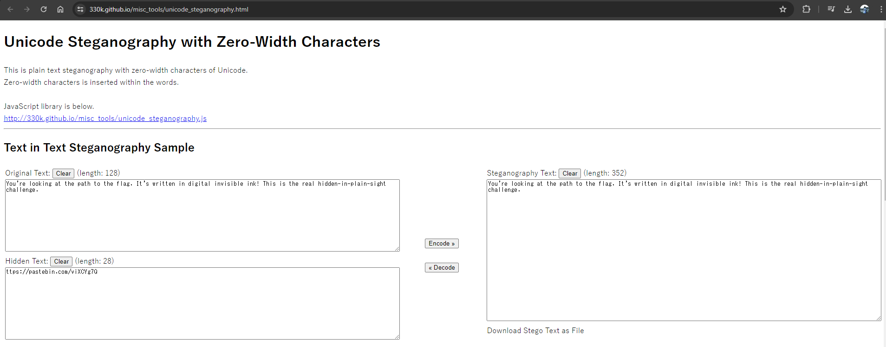
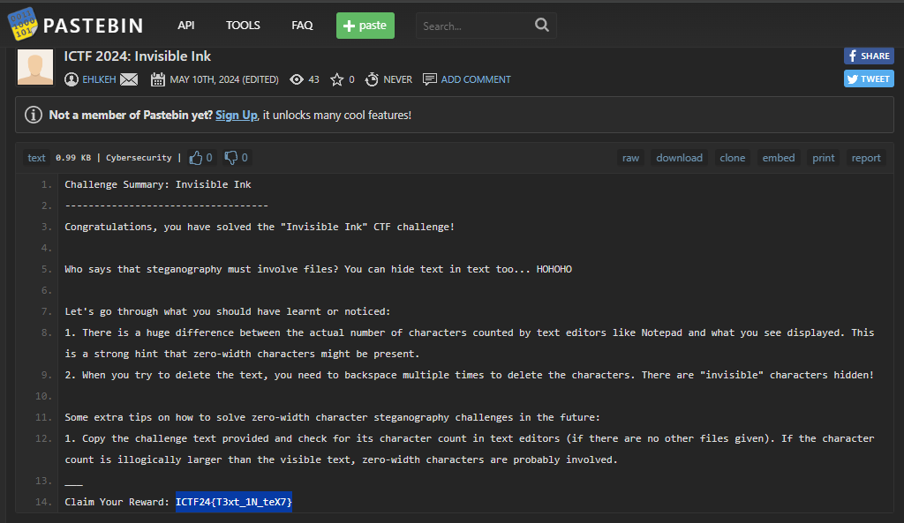

# Solution for challenge Invisible Ink


Description : 

> ‌‌‌‌‍‬‬‌You‌‌‌‌‍‍‌'‌‌‌‌‍‍‌re‌‌‌‌‍‌‌ looking at the path‌‌‌‌‍‌‌‌‌‌‌‬‬‌‌‌‌‌‬‌‌‌‌‌‬ ‌‌‌‌‍‌‌‌‌‌‌‍‬‌‍to ‌‌‌‌‍‌the‌‌‌‌‍‍‌‌‌‌‌‍‬‍‍ flag‌‌‌‌‍‬‌‬‌‌‌‌‍‬‬‍. It‌‌‌‌‍‬‬'s ‌‌‌‌‌‬‬written in‌‌‌‌‍‬‌ digital ‌‌‌‌‍‬invisible‌‌‌‌‍‬‍‌‌‌‌‌‬ ‌‌‌‌‍‍‬ink‌‌‌‌‍‬‬‍‌‌‌‌‍‍‬‌! This‌‌‌‌‍‌‌ is‌‌‌‌‍‍‬‍ the ‌‌‌‌‍‬‍real hidden‌‌‌‌‌‍-in‌‌‌‌‍‍‌‍-plain-sight challenge.

- Category : Steganography
- Points : 200

This is a tricky challenge althought it is a steganography challenge but no audio file or image file is provided. The only information you have is the description of the challenge. 

After intense searching, I manage to find this [writeup](https://medium.com/@bouss3id.abdelkader/mkv-videos-steganography-hide-data-using-zero-width-characters-ctf-write-up-5ec7b9d99a15). From the writeup, I manage to find [this](https://330k.github.io/misc_tools/unicode_steganography.html).



After decoding it, we get a link and openning the link we can get the flag ```ICTF24{T3xt_1N_teX7}``` and extra knowledge.



