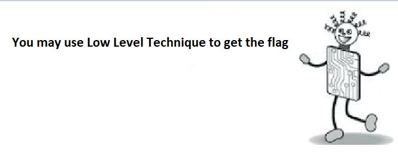
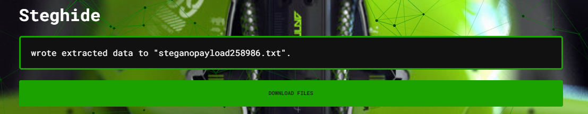
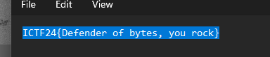

# Solution for challenge LMC_Stego


Description : 
- Category : Steganography
- Points : 200

In the challenge, 4 file is provided where 2 of the file is an image file and 1 audio file and 1 text file. 




<audio controls src="OWOW1.wav" title="Title"></audio>

# [X_X.txt](X_X.txt)

The clue image indicates that we may use Low Level Technique to get the flag which immediately think of Little Man Computer (LMC). The text file should be the opcode for the LMC. After running the opcode, we get the output of ```99 101 107 112 101 116```. By throwing it in the cyberchef, we get this string ```cekpet```.

As for the audio file, we can use audacity to open the file and inspect it. After opening the audio file in audacity, change the settings so that it shows in spectogram and we can see the word ```"steghide"```. 

> Steghide is a steganography program that is able to hide data in various kinds of image and audio files. Sometime it requires a passphrase.

Assumming that the string from the LMC is the passphrase, we can throw the image of ABOH into ```aperisolve``` to analysis the image and in the tab below the insert image, insert the password ```cekpet``` also. 



After done analysis, we can see that there is a file being extracted by steghide. Download the file and the flag is revealed.



``ICTF24{Defender of bytes, you rock}``